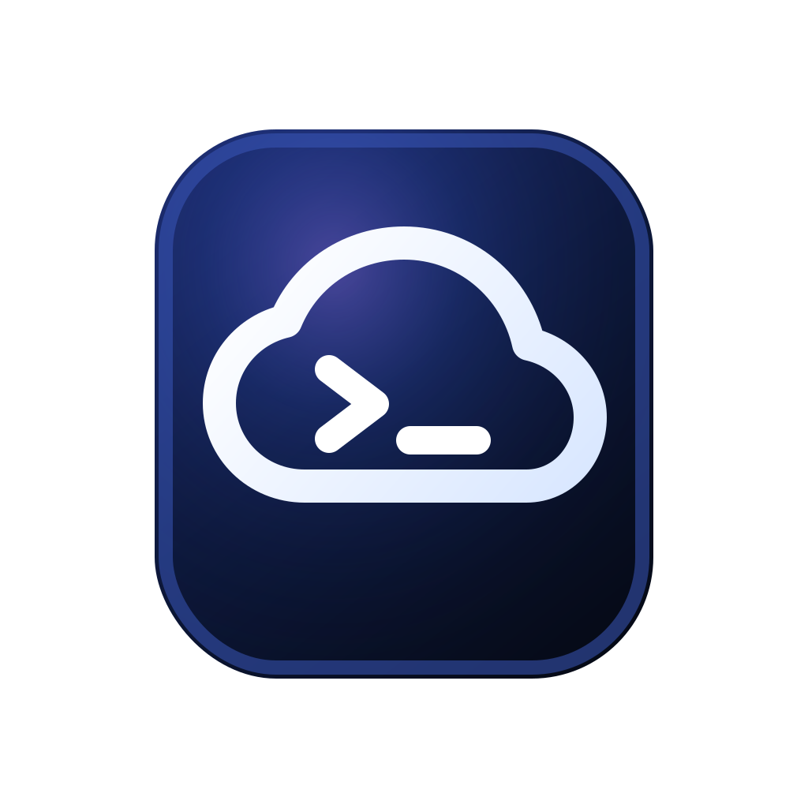

# Termira

<p align="center">
  
</p>

<p align="center">
  <strong>一个开源的 SSH 与服务器管理桌面客户端。</strong>
</p>

<p align="center">
  <a href="./LICENSE"></a>
  
  
</p>

Termira 面向开发者、后端工程师和运维人员，目标是在一个安静、清晰的桌面工作台里完成 SSH 登录、终端会话、SFTP 文件管理、端口转发、服务器监控和常用命令执行。

项目采用 clean-room 方式设计和实现，不使用任何商业 SSH 客户端的源码、图标、截图、品牌资产或专有文案。

## 功能亮点

- 主机管理：主机分组、搜索、收藏、最近连接、备注与标签。
- SSH 连接：支持密码、私钥路径、keyboard-interactive 密码式认证。
- 交互终端：多标签 shell、输入输出流式传输、PTY resize。
- SFTP 文件：目录浏览、上传、下载、重命名、删除、新建目录。
- 端口转发：本地转发、远程转发、动态 SOCKS 转发。
- 服务器工具：Linux 资源监控、进程列表、进程结束、快捷命令。
- 本地安全：本地 profile store 与加密 Vault，不依赖云账号。
- macOS 打包：可生成 `.app`、`.zip` 和 `.dmg` 产物。

## 当前状态

Termira 仍处于 alpha 阶段，当前优先支持 macOS Apple Silicon。核心能力已经打通并完成本地回归，后续会继续补齐签名、公证、发布流程、更多平台适配和更完整的用户体验。

当前限制：

- macOS 包暂未签名、未 notarize。
- 打包版需要系统可用的 Java 21 兼容运行时。
- Windows / Linux 桌面包尚未进入正式验证。

## 技术栈

- Desktop：Electron、React、TypeScript、Vite
- Terminal：xterm.js
- Backend sidecar：Java 21、Maven、SSHJ
- Storage：SQLite、本地加密 Vault
- Packaging：electron-builder、hdiutil

## 项目结构

```text
apps/
  desktop/        Electron main/preload + React renderer
  backend-java/   Java sidecar，承载 SSH/SFTP/转发/监控/Vault 能力
packages/
  shared/         前端与 Electron 共享的 TypeScript 类型
docs/             产品、架构、开发、安全、测试与阶段记录
```

## 开始使用源码

环境要求：

- macOS Apple Silicon
- Node.js 20 LTS 或更新稳定版本
- npm 10+
- JDK 21
- Maven

安装依赖：

```bash
npm install
```

启动开发环境：

```bash
npm run dev
```

该命令会启动 Vite、Electron main/preload watch、Electron 桌面应用和 Java sidecar。

## 常用脚本

```bash
npm run typecheck
npm run test
npm run build
npm run pack:mac
npm run dist:mac
```

- `npm run typecheck`：检查 desktop 与 shared TypeScript。
- `npm run test`：运行桌面端测试、shared 检查和 Java JUnit。
- `npm run build`：构建前端、Electron main/preload、shared 包和 Java fat jar。
- `npm run pack:mac`：生成未压缩的 macOS `.app`。
- `npm run dist:mac`：生成 macOS `.app`、`.zip` 和 `.dmg`。

## macOS 打包

完整打包：

```bash
npm run dist:mac
```

产物默认输出到：

```text
apps/desktop/release/
```

主要产物：

```text
Termira-0.1.0-arm64.dmg
Termira-0.1.0-arm64.zip
mac-arm64/Termira.app
```

打包配置位于 [apps/desktop/electron-builder.yml](apps/desktop/electron-builder.yml)，应用图标源文件位于 [apps/desktop/build/icon.svg](apps/desktop/build/icon.svg)。

生成 macOS `.icns` 图标：

```bash
npm run icon:mac -w apps/desktop
```

## 测试

运行完整本地回归：

```bash
npm run test
```

真实 SSH 环境的 E2E 测试通过环境变量注入凭据，敏感信息不会写入仓库：

```bash
read -s -r TERMIRA_E2E_SSH_PASSWORD
export TERMIRA_E2E_SSH_PASSWORD

TERMIRA_E2E_SSH_HOST=<host> \
TERMIRA_E2E_SSH_USER=<user> \
mvn -Dmaven.repo.local=.m2/repository \
  -f apps/backend-java/pom.xml \
  -Dtest=SshSessionManagerE2ETest,SftpManagerE2ETest,ForwardingManagerE2ETest,MonitorProcessE2ETest \
  test
```

私钥登录测试可额外设置：

```bash
TERMIRA_E2E_SSH_PRIVATE_KEY_PATH=/path/to/id_ed25519
TERMIRA_E2E_SSH_PRIVATE_KEY_PASSPHRASE=<optional>
```

未提供真实服务器环境变量时，相关 E2E 测试会自动跳过。

## 文档

- [需求文档](docs/需求文档.md)
- [架构文档](docs/架构文档.md)
- [开发文档](docs/开发文档.md)
- [安全设计文档](docs/安全设计文档.md)
- [测试验收文档](docs/测试验收文档.md)
- [阶段 7：打包、回归与人工验收](docs/阶段7-打包回归与人工验收.md)

## 路线图

- 发布签名与 macOS notarization。
- 内置 Java runtime，降低用户本机运行时要求。
- Windows 与 Linux 桌面包验证。
- 更完整的 SFTP 传输队列和失败重试体验。
- 终端主题、快捷键和布局偏好持久化。
- 跳板机、代理、审计和团队配置能力。

## 贡献

欢迎提交 issue、讨论产品方向、补充测试用例或发起 pull request。

建议在提交前执行：

```bash
npm run typecheck
npm run test
```

涉及打包相关改动时，也建议执行：

```bash
npm run dist:mac
```

## License

Termira is released under the [MIT License](LICENSE).
